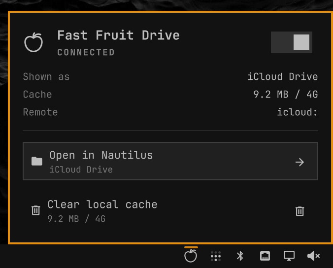

# Fast Fruit Drive

Fast Apple iCloud Drive integration with Omarchy.



- Does not mount the drive locally (which is slow) — it's only visible as a remote drive in Nautilus file manager (Super-Shift-F)
- Even faster than the browser version of iCloud!
- Suitable for large iCloud Drives — listings stay in the cloud; only files you open are cached on disk (`~/.cache/fast-fruit-drive/`)
- Includes a bar widget that serves **iCloud Drive** to Nautilus over local rclone WebDAV

Plugin id: `io.github.abort-retry-ignore.ff-drive`  
License: MIT (see [LICENSE](LICENSE))

## Install

```sh
omarchy pkg add gvfs-dnssd rclone
omarchy plugin add https://github.com/abort-retry-ignore/ff-drive.git --enable
```
Then click the fruit icon on the bar and toggle it on. Nautilus gets a sidebar
bookmark named **iCloud Drive**. 

## Remove

```sh
~/.config/omarchy/plugins/io.github.abort-retry-ignore.ff-drive/bin/fast-fruit-drive uninstall
omarchy plugin remove io.github.abort-retry-ignore.ff-drive
```
## Requirements

- [Omarchy](https://omarchy.org/) with third-party shell plugins
- [`rclone`](https://rclone.org/downloads/) on `PATH` (or `~/.local/bin/rclone`)
- `gvfs-dnssd` (Nautilus WebDAV backend) — see [Install](#install)
- `nautilus-python` (emblems; optional): `omarchy pkg add nautilus-python`

Install rclone from your package manager or [rclone.org/downloads](https://rclone.org/downloads/).
This plugin never downloads or executes remote installers.

## Sign-in and token expiry

iCloud login is **rclone's**, not this plugin's. The widget's **Sign in** button
opens a terminal and runs `rclone config reconnect icloud:` (or `rclone config`
if the remote does not exist yet).

- Use your real Apple ID password and 2FA. App-specific passwords are rejected.
- rclone stores `trust_token` / `cookies` in `~/.config/rclone/rclone.conf`.
- That trust token lasts **about 30 days**. After it expires, Sign in again.
- Fast Fruit Drive never copies or replaces that file; it only reads whether a session exists.

## Why

A FUSE mount of the whole drive (rclone mount / StratoSync) walks iCloud as if
it were local. Nautilus WebDAV lists folders on demand, skips thumbnails when
`show-image-thumbnails` is `local-only`, and is much snappier for browsing.

iCloud cannot stream/seek, so opened files are hydrated into a capped local
cache (`--vfs-cache-mode full`). Copying in Nautilus also works.

## Usage

- Left click: panel
- Right click: refresh
- Middle click: open in Nautilus
- In the panel: toggle the server, open Nautilus, sign in
- Keys: `r` refresh, `o` open, `i` sign in, `p` / Enter on the switch to toggle

Nautilus emblems (same idea as StratoSync):

- spinning arrows — still uploading (`Dirty` in the VFS cache)
- checkmark — in the local cache and uploaded
- document — listed from iCloud, not hydrated locally

Refresh the folder (Ctrl+R) if an emblem looks stale.

## Configure

```sh
omarchy bar move io.github.abort-retry-ignore.ff-drive --section right
```

| Setting | Default | Meaning |
|---|---|---|
| Local cache size | 4G | Cap for files you actually open |
| Cache max age | 24h | Unused cache entries are dropped |
| Refresh interval | 15s | How often the widget polls status |

Changing cache settings restarts the local WebDAV server.

The widget shells out to `bin/fast-fruit-drive`:

```sh
fast-fruit-drive status
fast-fruit-drive start
fast-fruit-drive stop
fast-fruit-drive toggle
fast-fruit-drive open
fast-fruit-drive uninstall
fast-fruit-drive configure cache_max_size=4G cache_max_age=24h
```

Config lives in `~/.config/fast-fruit-drive/config`. Cache lives in
`~/.cache/fast-fruit-drive`. The user systemd unit is `fast-fruit-drive.service`.

Starting the drive (explicit toggle or `start`) writes only:

- the user systemd unit
- a GTK bookmark named **iCloud Drive**
- a Nautilus Python extension copy
- this plugin's config file, if missing

## Safety

- No rclone purge/delete flags
- Cache eviction is local only
- Binds to `127.0.0.1` / `::1` only
- No sudo or pkexec
- Does not overwrite `rclone.conf`

## Development

```sh
omarchy plugin validate .
qmllint -I "${OMARCHY_PATH:-/usr/share/omarchy}/shell" Panel.qml Service.qml FruitIcon.qml
```
