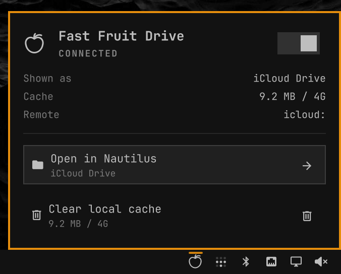

# Fast Fruit Drive

Fast Apple iCloud Drive integration with Omarchy.



- Does not mount the drive locally (which is slow) — it's only visible as a remote drive in Nautilus file manager (Super-Shift-F)
- Even faster than the browser version of iCloud!
- Suitable for large iCloud Drives — listings stay in the cloud; only files you open are cached on disk (`~/.cache/fast-fruit-drive/`)
- Includes a bar widget that serves **iCloud Drive** to Nautilus over local rclone WebDAV

Plugin id: `io.github.abort-retry-ignore.ff-drive`  
License: MIT (see [LICENSE](LICENSE))

## Install

```sh
omarchy pkg add gvfs-dnssd rclone
omarchy plugin add https://github.com/abort-retry-ignore/ff-drive.git --enable
```
Then click the fruit icon on the bar and toggle it on. Nautilus gets a sidebar
bookmark named **iCloud Drive**. 

## Remove

```sh
~/.config/omarchy/plugins/io.github.abort-retry-ignore.ff-drive/bin/fast-fruit-drive uninstall
omarchy plugin remove io.github.abort-retry-ignore.ff-drive
```
## Requirements

- [Omarchy](https://omarchy.org/) with third-party shell plugins
- `rclone` and `gvfs-dnssd` — installed by the command in [Install](#install)
- `nautilus-python` for emblems — included with a standard Omarchy install

Both packages come from the official repositories. This plugin never
downloads or executes remote installers.

## Local WebDAV authentication

The localhost WebDAV server requires a random per-install credential;
unauthenticated requests get HTTP 401. See [SECURITY.md](SECURITY.md) for
how the credential is generated, stored, and verified before GVFS ever
sees it. It is unrelated to your Apple password.

## Sign-in and token expiry

iCloud login is **rclone's**, not this plugin's. The widget's **Sign in** button
opens a terminal and runs `rclone config reconnect icloud:` (or `rclone config`
if the remote does not exist yet).

- Use your real Apple ID password and 2FA. App-specific passwords are rejected.
- rclone stores `trust_token` / `cookies` in `~/.config/rclone/rclone.conf`.
- That trust token lasts **about 30 days**. After it expires, Sign in again.
- Fast Fruit Drive never copies or replaces that file; it only reads whether a session exists.

## Why

A FUSE mount of the whole drive (rclone mount / StratoSync) walks iCloud as if
it were local. Nautilus WebDAV lists folders on demand, skips thumbnails when
`show-image-thumbnails` is `local-only`, and is much snappier for browsing.

iCloud cannot stream/seek, so opened files are hydrated into a capped local
cache (`--vfs-cache-mode full`). Copying in Nautilus also works.

## Usage

- Left click: panel
- Right click: refresh
- Middle click: open in Nautilus
- In the panel: toggle the server, open Nautilus, sign in
- Keys: `r` refresh, `o` open, `i` sign in, `p` / Enter on the switch to toggle

Nautilus emblems (same idea as StratoSync):

- spinning arrows — still uploading (`Dirty` in the VFS cache)
- checkmark — in the local cache and uploaded
- document — listed from iCloud, not hydrated locally

Emblems refresh themselves as files hydrate, upload, or get evicted —
Ctrl+R still works if anything ever looks stale.

## Configure

```sh
omarchy bar move io.github.abort-retry-ignore.ff-drive --section right
```

| Setting | Default | Meaning |
|---|---|---|
| Local cache size | 4G | Cap for files you actually open |
| Cache max age | 24h | Unused cache entries are dropped |
| Refresh interval | 15s | How often the widget polls status |

Changing cache settings restarts the local WebDAV server.

The widget shells out to `bin/fast-fruit-drive`:

```sh
fast-fruit-drive status
fast-fruit-drive start
fast-fruit-drive stop
fast-fruit-drive toggle
fast-fruit-drive open
fast-fruit-drive uninstall
fast-fruit-drive configure cache_max_size=4G cache_max_age_hours=24
```

Config lives in `~/.config/fast-fruit-drive/config` and only ever contains
`cache_max_size` and `cache_max_age_hours` — the only two settings this
plugin exposes. Everything else (remote name, bind address, port, DAV
host, display name, VFS mode) is a fixed constant, not something a config
file can steer. Cache lives in `~/.cache/fast-fruit-drive`. The user
systemd unit is `fast-fruit-drive.service`.

Starting the drive (explicit toggle or `start`) writes only:

- the user systemd unit
- a GTK bookmark named **iCloud Drive**
- a Nautilus Python extension copy
- this plugin's config file, if missing
- a random local WebDAV password and its htpasswd hash

## Safety

See [SECURITY.md](SECURITY.md) for the full trust model, including local
WebDAV authentication and the pending-upload guard on `clear-cache` and
`uninstall`. Summary:

- **Read/write.** Nautilus operations on the iCloud Drive bookmark apply to
  your real iCloud Drive, the same as any other Nautilus location.
- Binds to `127.0.0.1` / `::1` only; the local WebDAV server requires a
  random per-install credential, verified against the systemd `MainPID`
  before GVFS ever receives it. Unauthenticated requests get HTTP 401.
- `clear-cache` and `uninstall` refuse to run while any file has not
  finished uploading, and restart the service so the upload can continue.
- No rclone purge/delete flags; cache eviction is local only; does not
  overwrite `rclone.conf`; no sudo or pkexec.
- One isolated Python process (`python3 -I`) does all the work; there is
  no shell anywhere in the plugin. Every filesystem operation is
  descriptor-relative (`O_NOFOLLOW`, validate-and-use in the same call, no
  path re-resolved later). Tools are resolved as verified, root-owned
  absolute executables under a closed `PATH=/usr/bin`.
- Every widget-triggered command runs through a small supervisor that caps
  raw output at 64 KiB per stream before any line parsing, enforces a
  wall-clock deadline, and group-kills and reaps the whole process tree on
  timeout or overflow.
- The systemd unit is sandboxed: `ProtectSystem=strict`,
  `ProtectHome=read-only`, `NoNewPrivileges`, a stripped environment, an
  empty capability set, and more — see SECURITY.md for the full list.

## Development

```sh
omarchy plugin validate .
qmllint -I "${OMARCHY_PATH:-/usr/share/omarchy}/shell" Panel.qml Service.qml FruitIcon.qml
python3 -m unittest discover -s tests -v
```
